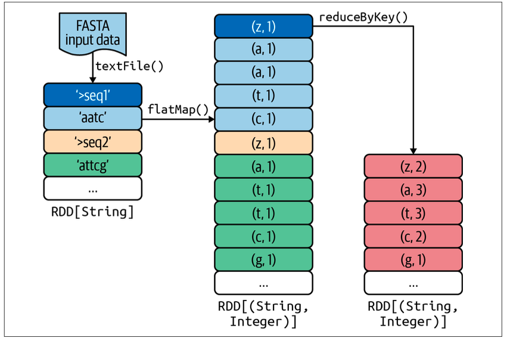
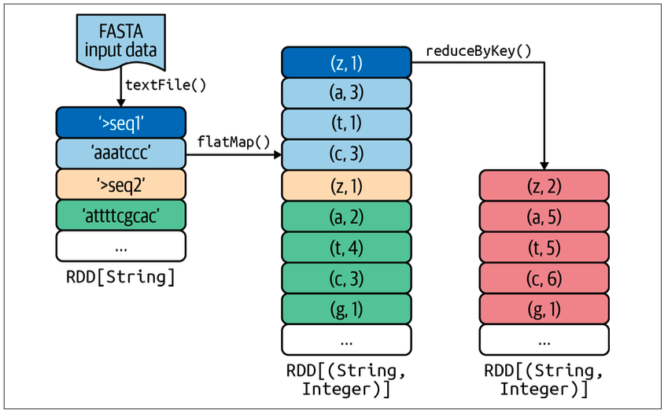
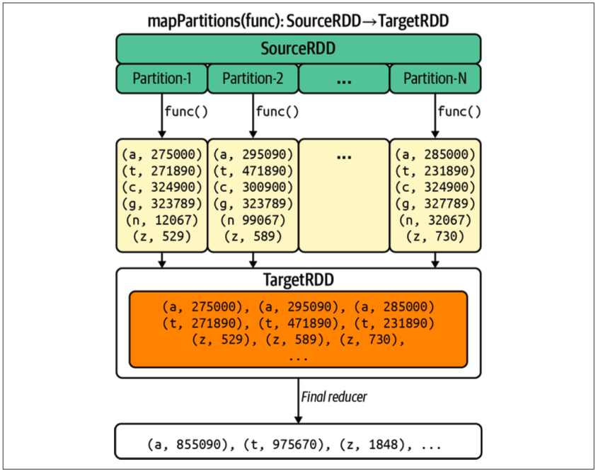

# Chapter 2: MapReduce Pattern - DNA Base Count

This chapter demonstrates the classic MapReduce pattern using DNA sequence analysis as an example. Three progressively optimized solutions are presented.

## Examples

| Example | Description | Shuffle Efficiency |
| --------- | ------------- | ------------------- |
| `dna_base_count_ver_1.py` | Basic flatMap + reduceByKey | Low (1 pair per character) |
| `dna_base_count_ver_2.py` | InMapper Combiner per record | Medium (1 pair per unique base per record) |
| `dna_base_count_ver_3.py` | mapPartitions (partition-level) | High (1 pair per unique base per partition) |

## Running Examples

```bash
# Run version 1 (basic) with default sample.fasta
make run-spark CHAPTER=chapter_02 EXAMPLE=dna_base_count_ver_1

# Run version 2 (InMapper Combiner per record)
make run-spark CHAPTER=chapter_02 EXAMPLE=dna_base_count_ver_2

# Run version 3 (mapPartitions - most efficient)
make run-spark CHAPTER=chapter_02 EXAMPLE=dna_base_count_ver_3

# Run with a custom FASTA file
make run-spark CHAPTER=chapter_02 EXAMPLE=dna_base_count_ver_1 ARGS="/path/to/your/file.fasta"
```

## FASTA File Format

FASTA is a text-based format for DNA/RNA sequences:

- Lines starting with `>` are headers (sequence identifiers)
- Following lines contain the sequence (A, T, C, G) bases
- The letter N represents an unknown or ambiguous base

```text
>sequence_name description
ATCGATCGATCG
GCTAGCTAGCTA
```

## Key Concepts

- Why reduceByKey() over groupByKey() For a large set of (key, value) pairs, using `reduceByKey()` or `combineByKey()` is typically more efficient than using the combination of `groupByKey()` and `mapValues()`, because they reduce the shuffling time.

    ```python
    # These produce the same results:
    rdd.groupByKey().mapValues(lambda values: sum(values))
    rdd.reduceByKey(lambda x, y: x + y)
    ```

    However, `groupByKey()` transfers the entire dataset across the network, while `reduceByKey()` computes local sums in each partition first and only shuffles the partial results. This makes `reduceByKey()` significantly faster for most use cases.

- `map()` Versus `mapPartitions()` What are the main differences between Spark’s map() and mapPartitions() transformations? In a nutshell, map() is a 1-to-1 transformation: it maps each element of the source RDD into a single element of the target RDD. mapPartitions(), on the other hand, can be considered a many-to-1 transformation: it maps each partition (comprising many elements of the source RDD—each partition may have thousands or millions of elements) into a single element of the target RDD. The main advantage of this is that it means we can do initialization on a per-partition basis instead of per-element basis (as is done by map() and
foreach()).

- **Summarization Design Pattern** Spark’s `mapPartitions()` transformation can be used to implement the summarization design pattern, which is useful when you’re working with big data and you want to get a summary view so you can glean insights that are not available from looking at a localized set of records alone. This design pattern involves grouping similar data together and then performing an operation such as calculating a statistic, building an index, or simply counting.

- For example, if you want to find the minimum and maximum of all numbers in your input, using `map()` can be pretty inefficient, since you will be generating tons of intermediate (key, value) pairs but the bottom line is that you want to find just two numbers. It’s also useful if you want to find the top 10 (or bottom 10) values in your input. mapPartitions() does this efficiently: you find the top (or bottom) 10 per partition, then the top (or bottom) 10 for all partitions. This way, you avoid emitting too many intermediate (key, value) pairs.

## The Three Solutions Explained

### Version 1: Basic MapReduce



**Algorithm:**

1. `flatMap()`: Each character emits (base, 1)
2. `reduceByKey()`: Sum all counts per base

**Pros:**

- Simple and easy to understand
- No scalability issue since `reduceByKey()` performs local aggregation

**Cons:**

- Emits a large number of (key, value) pairs (one per character)
- Network becomes a bottleneck due to high shuffle volume

### Version 2: InMapper Combiner (per Record)



**Algorithm:**

1. `flatMap()` with local hashmap: Aggregate counts within each record
2. `reduceByKey()`: Sum all counts per base

**Pros:**

- Reduces intermediate pairs (one per unique base per record instead of one per character)
- Less shuffle data than Version 1

**Cons:**

- Still creates a hashmap per record
- Not as efficient as partition-level aggregation

### Version 3: mapPartitions (Partition-level InMapper Combiner)



**Algorithm:**

1. `mapPartitions()`: Process entire partition, build single hashmap
2. `reduceByKey()`: Sum partition-level counts

**Pros:**

- Most efficient: emits at most 6 pairs per partition (A, T, C, G, N, z)
- Minimal shuffle data
- Best choice for large datasets

**Cons:**

- Slightly more complex code
- Partition must fit in memory (rarely an issue in practice)

## Performance Comparison

For a file with N characters across P partitions:

| Version | Intermediate Pairs | Shuffle Volume |
| --------- | ------------------- | ------------------- |
| Ver 1 | N pairs | O(N) |
| Ver 2 | ~N/avg_record_length pairs | O(N/record_size) |
| Ver 3 | ~6 * P pairs | O(P) |

## Additional Resources

- Larger FASTA Datasets: [University of California, Santa Cruz](https://hgdownload.soe.ucsc.edu/downloads.html)
