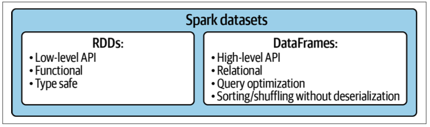

# Chapter 3: Mapper Transformations

This chapter covers the fundamental mapper transformations in PySpark: `map()`, `flatMap()`, `mapPartitions()`, and `mapValues()`. Understanding when to use each transformation is key to writing efficient Spark applications.

## Examples

| Example | Description | Use Case |
| --------- | ------------- | --------- |
| `map_vs_flatmap.py` | Comparison of `map()` (1-to-1) vs `flatMap()` (1-to-many) | Flattening, tokenization |
| `mappartitions_transformation.py` | Using `mapPartitions()` for efficient batch processing | Local aggregation, expensive setup |
| `mapvalues_transformation.py` | Using `mapValues()` to transform only values in pairs | Key-value processing, averages |

## Running Examples

```bash
# Run map vs flatMap comparison
make run CHAPTER=chapter_03 EXAMPLE=map_vs_flatmap

# Run mapPartitions with default sample data
make run CHAPTER=chapter_03 EXAMPLE=mappartitions_transformation

# Run mapPartitions with a custom data file
make run-spark CHAPTER=chapter_03 EXAMPLE=mappartitions_transformation \
    ARGS="src/chapter_03/data/sample_numbers.txt"

# Run mapValues demonstration
make run CHAPTER=chapter_03 EXAMPLE=mapvalues_transformation
```

## Key Concepts



### map() vs flatMap()

The fundamental difference between these transformations:

| Transformation | Output per Input | Total Elements | Use Case                           |
| -------------- | ---------------- | -------------- | ---------------------------------- |
| `map()`        | Exactly 1        | Same as input  | 1-to-1 transformations             |
| `flatMap()`    | 0 or more        | Can differ     | Tokenization, filtering, expanding |

```python
sentences = ["hello world", "spark is awesome"]
rdd = sc.parallelize(sentences)

# map() - each sentence becomes a list (nested structure)
rdd.map(lambda s: s.split())
# Result: [["hello", "world"], ["spark", "is", "awesome"]]

# flatMap() - all words flattened into single list
rdd.flatMap(lambda s: s.split())
# Result: ["hello", "world", "spark", "is", "awesome"]
```

**Key insight**: `flatMap()` is essential for word count and similar algorithms where you need to "explode" elements.

### mapPartitions()

Processes entire partitions at once instead of element by element. This enables the **InMapper Combiner** pattern for efficient local aggregation.

```python
def process_partition(partition):
    """Aggregate within partition before emitting."""
    local_sum = 0
    local_count = 0
    for num in partition:
        local_sum += num
        local_count += 1
    yield (local_sum, local_count)  # Emit ONE tuple per partition

# Using mapPartitions
rdd.mapPartitions(process_partition)
```

**When to use mapPartitions():**

- **Expensive setup/teardown**: Database connections, ML model loading
- **Local aggregation**: Sum, count, min/max per partition first
- **Batch API calls**: Process multiple records per API request
- **Resource management**: Open file handles once per partition

**Trade-offs:**

| Aspect         | map()                   | mapPartitions()              |
| -------------- | ----------------------- | ---------------------------- |
| Function calls | Once per element        | Once per partition           |
| Memory         | Low                     | Higher (processes batch)     |
| Setup cost     | Per element             | Per partition (amortized)    |
| Shuffle data   | More intermediate pairs | Fewer intermediate pairs     |

### mapValues()

Transforms only the values of key-value pairs while preserving keys and partitioning.

```python
pairs = [("a", 1), ("b", 2), ("a", 3)]
rdd = sc.parallelize(pairs)

# Using map() - must handle both key and value
rdd.map(lambda kv: (kv[0], kv[1] * 2))

# Using mapValues() - cleaner, preserves partitioning
rdd.mapValues(lambda v: v * 2)
# Result: [("a", 2), ("b", 4), ("a", 6)]
```

**Why mapValues() over map():**

1. **Cleaner syntax** - no tuple destructuring needed
2. **Preserves partitioning** - critical for shuffles (map() may not)
3. **Clear intent** - indicates only values are being transformed

### Common Pattern: Average by Key

A frequently used pattern combining `reduceByKey()` and `mapValues()`:

```python
# Input: (key, value) pairs
scores = [("alice", 85), ("bob", 90), ("alice", 92)]
rdd = sc.parallelize(scores)

# Step 1: Transform to (key, (value, 1))
sum_count = rdd.map(lambda x: (x[0], (x[1], 1)))

# Step 2: Reduce to sum values and counts
totals = sum_count.reduceByKey(lambda a, b: (a[0] + b[0], a[1] + b[1]))

# Step 3: Compute averages using mapValues
averages = totals.mapValues(lambda v: v[0] / v[1])
# Result: [("alice", 88.5), ("bob", 90.0)]
```

## The Three Mapper Transformations Compared

### map() - Element-wise Processing

**Algorithm:**

1. Apply function to each element independently
2. Each input produces exactly one output
3. No aggregation or flattening

**Pros:**

- Simple and intuitive
- Low memory overhead
- Works on any RDD type

**Cons:**

- Cannot produce multiple outputs per input
- Setup costs incurred per element
- No local aggregation

### flatMap() - Flattening Transformation

**Algorithm:**

1. Apply function to each element (function returns iterable)
2. Flatten all iterables into single sequence
3. Empty iterables contribute nothing (implicit filtering)

**Pros:**

- Essential for tokenization and expansion
- Handles variable-length outputs
- Can filter by returning empty iterables

**Cons:**

- Slightly more complex than map()
- Must return iterable (not single value)

### mapPartitions() - Batch Processing

**Algorithm:**

1. Process entire partition as iterator
2. Yield results (any number per partition)
3. Results combined into output RDD

**Pros:**

- Amortizes setup costs across partition
- Enables local aggregation (InMapper Combiner)
- Reduces shuffle data significantly

**Cons:**

- Higher memory usage (batch processing)
- More complex function signature
- Must handle empty partitions

## Performance Considerations

For operations requiring aggregation, the choice of transformation significantly impacts performance:

| Approach                            | Intermediate Pairs          | Network Traffic |
| ----------------------------------- | --------------------------- | --------------- |
| `map()` + `reduceByKey()`           | N pairs (one per element)   | O(N)            |
| `mapPartitions()` + `reduceByKey()` | P pairs (one per partition) | O(P)            |

Where N = number of elements, P = number of partitions (typically P << N).

**Example**: Counting numbers in 1 million elements across 100 partitions:

- `map()`: Emits 1,000,000 intermediate pairs
- `mapPartitions()`: Emits ~100 intermediate pairs (one per partition)

## Additional Resources

- [Spark RDD Programming Guide](https://spark.apache.org/docs/latest/rdd-programming-guide.html)
- [PySpark RDD API Documentation](https://spark.apache.org/docs/latest/api/python/reference/api/pyspark.RDD.html)
